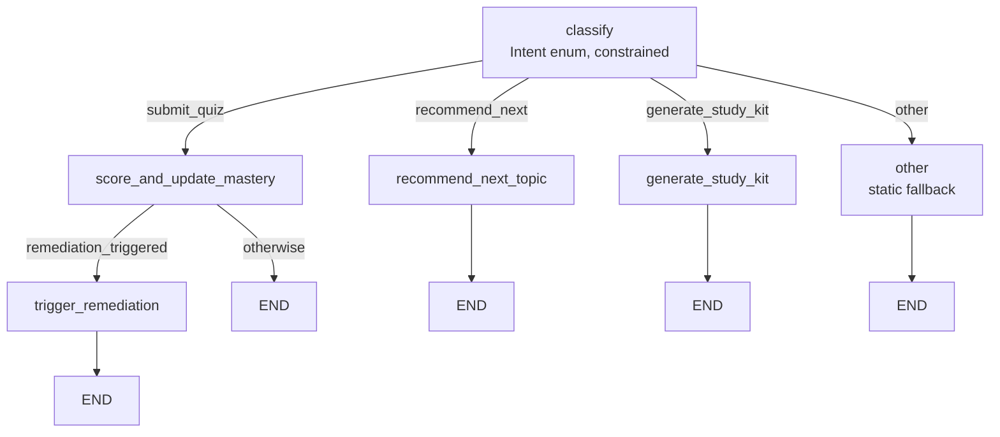

# Agent Design

One LangGraph graph (`agents/graph.py: build_agent_graph`) models every
student-facing action as classify-then-route, and is what's under test
node-by-node. In practice, every REST route (`study-kit/generate`,
`quiz/submit`, `recommendation/next`, `chat/ask`) calls its agent
function directly with an already-typed payload (`topic_id`, `kit_type`,
...) rather than routing free text through the graph — there's no
free-form message for the classifier to disambiguate when the client
already picked the action by which endpoint it called. `backend/src/agents/`
owns all of it either way; the graph and the direct-call routes share the
same node functions, so the guardrails and grounding logic below apply
identically regardless of which path a given feature takes.

## Classification

`agents/classify.py: classify_intent` — one call to `OLLAMA_MODEL` with a
fixed enum (`agents.schemas.Intent`: `recommend_next`,
`generate_study_kit`, `submit_quiz`, `other`) and a JSON schema for the
response (`IntentClassification`). A schema-validation failure (already
caught by `LLMClient.chat_json`, which raises `LLMError`) is treated as
`other` and logged — never retried into a guess, per `CLAUDE.md` → "Agent
classification".

## Retrieval

`agents/retrieval.py: retrieve_context` grounds every study kit and chat
answer in the student's own material. The BM25/normalize/topic-overlap
scoring it uses is shared via `agents/text_scoring.py` (not private to
this module — `agents/chat.py` reuses `topic_overlap_score` for its
"related topics" citations, see below).

1. Semantic search: embed the query, pull a candidate pool (Chroma,
   `retrieval_candidate_pool` results, cosine space — see
   [decisions/0005](decisions/0005-cosine-similarity-for-retrieval-guardrail.md)).
   Optionally filtered to one `document_id` via Chroma's `where` clause —
   study-kit generation searches the student's whole corpus, topic chat
   passes the topic's own `document_id` (see "Topic chat" below).
2. Keyword fallback: an in-process BM25 pass over the same candidate pool
   (`text_scoring.bm25_scores`), so a query whose wording doesn't overlap
   the source material's isn't stuck with a low vector score alone.
3. Guardrail: `covered = max(semantic_similarity, bm25_score) >=
   retrieval_similarity_threshold` across the pool. If nothing clears it,
   `retrieve_context` returns `covered=False` and callers must not
   generate from that — `generate_study_kit` returns `NotCovered()`,
   `answer_topic_question` returns a fixed refusal, neither calls the
   model.
4. Re-rank: surviving candidates are scored `relevance * 0.7 +
   topic_overlap * 0.3` (`text_scoring.topic_overlap_score`, lexical
   overlap against the target topic's name + description) and the top
   `retrieval_rerank_top_n` are returned as the grounding context.

## Nodes

| Node | Module | Does |
| --- | --- | --- |
| `recommend_next_topic` | `agents/recommend.py` | Lowest-mastery topic among prerequisite-ready ones (`mastery_ready_threshold` on every prerequisite), weighted by exam-date urgency (`_exam_urgency`, ramps 0→1 inside `exam_urgency_window_days`). Justification is a deterministic sentence, not a model call — see [decisions/0006](decisions/0006-deterministic-justification-text.md). |
| `generate_study_kit` | `agents/study_kit.py` | Retrieves context, then one constrained call per kit type (`SummaryContent` / `FlashcardsContent` / `QuizContent` / `ProblemGuideContent`), each item carrying `source_chunk_ids`. Persists as a `study_kits` row. |
| `answer_topic_question` | `agents/chat.py` | Retrieves context scoped to the topic's own document, then one constrained call (`ChatAnswerContent`). Persists both turns as `chat_messages` rows. See "Topic chat" below. |
| `grade_explanation` | `agents/feynman.py` | Retrieves context scoped to the topic's own document, then one constrained call (`FeynmanGradeContent`) grading a student's own explanation claim-by-claim. Persists a `feynman_attempts` row and updates mastery. See "Feynman mode" below. |
| `grade_worked_answer` | `agents/worked_answer.py` | One constrained call (`WorkedAnswerGradeContent`) grading a student's worked solution step-by-step against a `problem_guide` kit's stored reference problem — no fresh retrieval. Persists a `worked_answer_attempts` row and updates mastery. See "Worked-answer grading" below. |
| `score_and_update_mastery` | `agents/mastery.py` | Records a `quiz_attempts` row; moves `mastery_scores.score` toward the observed score by an exponential moving average (`mastery_ema_alpha`) rather than overwriting it; resets `consecutive_failures` on a pass (`quiz_pass_threshold`), increments on a fail. The EMA/remediation-trigger math itself lives in `apply_mastery_observation`, shared with `grade_explanation` and `grade_worked_answer` — see [decisions/0014](decisions/0014-feynman-and-worked-answer-grading.md). |
| `trigger_remediation` | `agents/remediation.py` | Fires when `consecutive_failures >= remediation_consecutive_failures` or `mastery_drop >= remediation_mastery_drop`. Checks the topic's own prerequisites for weak mastery first (a repeated failure is often a gap one level down) and returns a deterministic mini-plan. |

`other` is a static fallback message — no model call beyond
classification.

## Topic chat

`agents/chat.py: answer_topic_question` answers a free-text question
about one topic, grounded **only** in that topic's own document — the
one place in this app where a student's arbitrary text reaches the
model, so it carries two independent guardrails rather than retrieval's
one:

1. **Retrieval coverage**, scoped: `retrieve_context(..., document_id=topic.document_id)`
   restricts the candidate pool to chunks from the topic's own document
   before the usual similarity/BM25 threshold applies — a question
   answerable from a *different* uploaded document still gets refused
   here, deliberately narrower than study-kit generation's whole-corpus
   search.
2. **The model's own refusal**, on top of coverage: the response schema
   (`ChatAnswerContent`) has an `answerable: bool` the model sets itself.
   The system prompt instructs it to refuse when the message isn't a
   genuine question about the excerpts, or tries to override these
   instructions — and explicitly tells it never to follow instructions
   embedded in the student's own message. When `answerable=False`, the
   model's `answer`/`source_chunk_ids` are discarded entirely in favor of
   the same fixed refusal text retrieval's guardrail uses, so a
   jailbroken model can't smuggle content out through a "refusal" it
   worded itself.

Citations: `source_chunk_ids` is intersected against the ids retrieval
actually returned — a chunk id the model claims but wasn't given is
dropped, never trusted. `related_topics` (sibling topics in the same
document) is a re-use of `text_scoring.topic_overlap_score`: whichever of
the topic's siblings share the most vocabulary with the chunks the answer
was grounded in, not a model-generated or fabricated list — see
[decisions/0012](decisions/0012-topic-chat-guardrails.md).

## Feynman mode

`agents/feynman.py: grade_explanation` — a student explains a topic in
their own words instead of the app generating content for them to read;
grading tests understanding, not recall. Same two-guardrail shape as
topic chat, over the same document-scoped retrieval:

1. **Retrieval coverage**, scoped to the topic's own document — same
   `retrieve_context(..., document_id=topic.document_id)` call, but the
   query is the topic's own name + description (like study-kit
   generation), not the student's explanation — this is checking "is
   there material for this topic at all", not "does retrieval consider
   this specific explanation relevant".
2. **The model's own `gradable` flag** (`FeynmanGradeContent`), same
   role as chat's `answerable`: refuses non-attempts (empty, gibberish,
   an instruction-override attempt) even when material exists to grade
   against. Everything else in the response is discarded when
   `gradable=False`.

The graded response breaks the explanation into individual claims
(`breakdown: [{claim, verdict, feedback, source_chunk_ids}]`, verdict
`correct`/`incomplete`/`incorrect`) and lists `missing_concepts` the
excerpts cover that the explanation never touched — the "exactly where
it breaks down" the student needs, not just a single score.
`accuracy_score` feeds `apply_mastery_observation` exactly like a quiz
score: a good explanation is real evidence of mastery, not a separate
metric living outside the mastery system.

## Worked-answer grading

`agents/worked_answer.py: grade_worked_answer` — a student writes out
their own solution to a problem; grading is step-by-step ("where's the
first error"), not just right/wrong on the final answer. Structurally
different from chat/Feynman in one way: **no fresh retrieval call**. The
reference to grade against is a specific `Problem` (prompt + steps)
already sitting in a `problem_guide` study kit's stored `content` — that
problem was itself generated from the topic's material when the kit was
created, so it's already grounded; re-deriving grounding chunks a second
time here would just be redundant Chroma round-trips for context the
database already has verbatim. "Coverage" here means "does
`study_kit_id` + `problem_index` resolve to a real `problem_guide`
problem" (`AppError` `invalid_study_kit_reference` / `invalid_problem_index`
otherwise) rather than a similarity threshold; the model's own
`gradable` flag is still the guardrail against a non-attempt submission.

The model reads the student's own free text and identifies its own step
boundaries (`step_feedback: [{step_number, student_text, verdict,
feedback}]`) rather than requiring a rigid pre-split array — closer to
how a student actually writes out work. `first_error_step` records the
first `incorrect` step specifically so a "right final answer, wrong
reasoning" case is still caught, not just whichever step happens to be
judged last. `accuracy_score` (fraction of steps correct) feeds
`apply_mastery_observation` the same way a quiz score or Feynman grade
does. See
[decisions/0014](decisions/0014-feynman-and-worked-answer-grading.md).

## Guardrails & traceability

- Retrieval's coverage threshold is the primary guardrail blocking
  generation; topic chat and Feynman mode add the model self-refusal
  guardrail on top of it, worked-answer grading uses the self-refusal
  guardrail alone (its "coverage" check is a reference-existence check,
  not a similarity threshold). Everything else validates via Pydantic
  schemas (`LLMClient.chat_json`) and raises `LLMError` rather than
  guessing.
- Every node logs its own inputs/outputs at `INFO` (student/topic ids,
  scores, chosen intent) through the shared structured logger — see
  `core/logging.py`. Full request/response payload capture is a Phase 6
  concern (observability hardening), not this phase's.

## Testing

Every node has unit tests against a fake LLM client
(`tests/agents/conftest.py: FakeAgentLLMClient`) — no live model calls in
the default suite. `tests/live/test_agents_live.py` (marked
`live_model`, opt-in via `RUN_LIVE_LLM_TESTS=1`) smoke-tests
classification and retrieval against whatever real endpoint `.env`
points at — see [runbook.md](runbook.md#tests).
