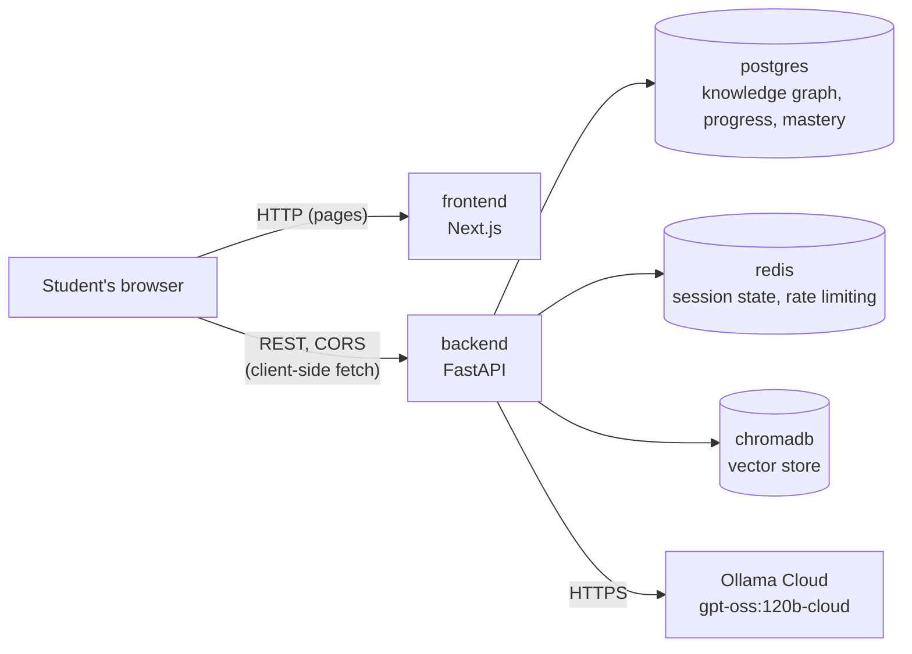

# Architecture

Five independent Docker services on one bridge network — never a single
container running everything.

The browser talks to `backend` directly for every API call (auth, data,
generation) — `frontend` only ever serves the page shell, never proxies
API requests. That's why CORS (above) matters: `frontend` and `backend`
are two different origins from the browser's point of view even on one
Docker network.

## Services

| Service | Image | Responsibility | Healthcheck |
| --- | --- | --- | --- |
| `frontend` | built from `frontend/Dockerfile` | Next.js UI | `GET /` (prod image only; dev override has none) |
| `backend` | built from `backend/Dockerfile` | FastAPI: API layer, agent orchestration | `GET /health` |
| `postgres` | `postgres:16-alpine` | Users, knowledge graph, progress, mastery scores | `pg_isready` |
| `redis` | `redis:7-alpine`, AOF persistence on | Session state, rate limiting, short-lived agent memory | `redis-cli ping` |
| `chromadb` | `chromadb/chroma:0.5.20` | Chunk embeddings for RAG | `GET /api/v1/heartbeat` |

`backend` waits on `postgres`, `redis`, and `chromadb` being healthy;
`frontend` waits on `backend` being healthy. All five sit on the
`learn_buddy_net` bridge network defined in `docker-compose.yml`.

The LLM is **not** a local service. `OLLAMA_BASE_URL` /  `OLLAMA_API_KEY` /
`OLLAMA_MODEL` / `OLLAMA_EMBED_MODEL` (`.env`) point the backend at Ollama
Cloud over HTTPS — no `ollama` container exists in `docker-compose.yml`.
Every call to it goes through `core/llm_client.py` (embeddings + structured
chat completions), used today by the ingestion pipeline.

## Images

- `backend/Dockerfile`: multi-stage, `uv`-based. Builder stage runs
  `uv sync --frozen` against `pyproject.toml`/`uv.lock`; runtime stage
  (`python:3.10-slim`) copies only the resulting `.venv` and source, runs
  as a non-root user, no build tooling present.
- `frontend/Dockerfile`: three stages — `deps` (npm install), `builder`
  (`next build` with `output: "standalone"`), `runtime` (copies the
  standalone server + static assets only, runs `node server.js` as a
  non-root user). A separate `dev` stage (`npm run dev`) is what
  `docker-compose.override.yml` targets locally for hot reload.

## Local vs. production compose

`docker-compose.yml` is the base file: built `runtime`-stage images
(`target: runtime` pinned explicitly on both `backend` and `frontend` —
see [decisions/0009](decisions/0009-pin-docker-build-target.md)), no bind
mounts, no published port for `postgres`/`redis`/`chromadb` (only
reachable from other containers on `learn_buddy_net`).

Two overlays, applied differently:

- **`docker-compose.override.yml`** — merged in *automatically* by
  `docker compose` whenever no `-f` flag is given at all (i.e. every
  plain `docker compose up`/`make up`). Dev-only: targets the `frontend`
  `dev` build stage, bind-mounts both services' source trees for live
  reload (`uvicorn --reload`, `next dev`) with each container's own
  dependencies (`.venv`, `node_modules`, `.next`) kept in anonymous
  volumes so the bind mount doesn't shadow them, and publishes the three
  datastores' ports to the host for local `psql`/`redis-cli`/etc access.
- **`docker-compose.prod.yml`** — only applied when named explicitly
  (`docker compose -f docker-compose.yml -f docker-compose.prod.yml
  up -d --build`), which also means `override.yml` is *not* auto-applied
  alongside it. Adds `restart: always`, per-service CPU/memory limits and
  reservations (`deploy.resources`, honored by plain `docker compose up`,
  not just Swarm), and log rotation. Leaves the base file's already-safe
  defaults (no bind mounts, no published datastore ports) untouched
  rather than trying to re-remove them — see the file's own header
  comment for why an overlay can't reliably do that (list fields like
  `ports` concatenate across merged compose files, they don't replace).

## Backend internals

`backend/src/` follows the layout fixed in `CLAUDE.md`:

| Package | Owns |
| --- | --- |
| `api/` | FastAPI routers — `health.py`, `auth.py`, `documents.py`, `graph.py`, `progress.py`, `recommendation.py`, `study_kit.py`, `quiz.py`, `chat.py`, `feynman.py`, `worked_answer.py` — and request-scoped dependencies (`deps.py`: auth, rate limiting). Thin — no business logic; see [api-reference.md](api-reference.md). |
| `domain/` | Framework-agnostic business logic. `documents.py` owns document lifecycle (idempotent get-or-create by content hash, student-scoped queries); `topics.py` owns student-scoped topic lookup, sibling lookup, and batch id→name lookup, used by `agents/`; `chat.py`, `feynman.py`, `worked_answer.py` each own their attempt table's list-for-history query. |
| `agents/` | LangGraph graph (`graph.py`), intent classifier (`classify.py`), retrieval (`retrieval.py`: semantic + BM25 fallback + topic re-rank, optionally scoped to one document), shared scoring helpers (`text_scoring.py`), shared mastery math (`mastery.py: apply_mastery_observation`), and the action nodes (`recommend.py`, `study_kit.py`, `chat.py`, `feynman.py`, `worked_answer.py`, `mastery.py`, `remediation.py`). See [agent-design.md](agent-design.md). |
| `ingestion/` | `parsers/` (PDF/DOCX/PPTX → `ParsedDocument`), `chunker.py`, `embedder.py`, `topic_extractor.py`, `pipeline.py` (orchestrates all of it), `storage.py` (raw file storage). See [ingestion.md](ingestion.md). |
| `db/` | SQLAlchemy models (`models/`), declarative `Base` + naming convention (`base.py`), async engine/session (`session.py`). See [data-model.md](data-model.md). |
| `core/` | Cross-cutting: `config.py` (pydantic-settings), `logging.py` (structured JSON), `security.py` (JWT + password hashing), `errors.py` (`{code, message}` envelope + handlers), `cache.py` (Redis wrapper), `vectorstore.py` (Chroma wrapper), `llm_client.py` (the one Ollama Cloud client — embeddings + JSON-schema-constrained chat). |

`src/main.py` is the app factory (`create_app()`); it registers error
handlers and routers and is what `uvicorn src.main:app` serves. Alembic
migrations live in `backend/migrations/`, driven by `backend/alembic.ini`
and reading `DATABASE_URL` from the same `Settings` object the app uses.

Auth: `api/auth.py` (`/auth/register`, `/login`, `/refresh`, `/logout`)
issues short-lived JWT access tokens (15 min default) plus longer-lived,
single-use refresh tokens (7 days default, rotated on every `/refresh` —
the presented token's `jti` is blacklisted in Redis for its remaining
validity), both HS256-signed with `JWT_SECRET`. `api/deps.py:
get_current_student` is the FastAPI dependency every protected route
depends on — it resolves the bearer token to a `Student` row, so
per-student query scoping starts at the dependency, not each handler.
`api/deps.py: rate_limiter` is the same pattern for cost control: a
dependency factory over `CacheClient.incr_with_ttl`, applied to
`/study-kit/generate` (the one route that calls the model to generate new
content) — see [api-reference.md](api-reference.md).

CORS: the frontend is a separate origin (`frontend:3000` vs.
`backend:8000` even inside the Docker network, `localhost:3000` vs.
`localhost:8000` host-direct), so every browser request needs
`CORSMiddleware` — `CORS_ALLOWED_ORIGINS` (`.env`, comma-separated) is
where the frontend's origin(s) are allow-listed.

## Frontend internals

`frontend/src/` follows the layout fixed in `CLAUDE.md`:

| Package | Owns |
| --- | --- |
| `app/` | Next.js App Router pages — `/`, `/login`, `/register`, `/upload`, `/dashboard`, `/study-kit/[topicId]`. Thin: each page is `<AuthGuard><SomeClientComponent /></AuthGuard>`, no fetching in the page file itself. |
| `components/` | Shared UI (`ui/`: `Button`, `Card`, `Spinner`, `ErrorBanner`, `Badge`, `MasteryTicks`, `MasteryDial`, `Latex` — bare-LaTeX-string → KaTeX, no DOM APIs so it needs no `"use client"`) and feature components: `app-shell.tsx` (renders `sidebar.tsx` + `topbar.tsx` around authenticated pages, or just `children` when logged out — see [decisions/0013](decisions/0013-sidebar-topbar-app-shell.md)), `auth-guard.tsx`, `auth-form.tsx`, `upload-dropzone.tsx`, `document-list.tsx`, `dashboard/*` (recommended-next, remediation-alert, unit-filters, topic-ledger), `topic/*` (topic-page-content, prerequisite-chain, kit-section, feynman-mode, topic-chat, agent-activity — a simulated per-request agent-pipeline progress indicator, reused by kit generation, Feynman grading, worked-answer grading, and chat), `study-kit/*` (one view per kit type, plus `formula-sheet.tsx` and `worked-answer-check.tsx`). |
| `lib/` | `api.ts` (the one typed client), `token-store.ts` (localStorage), `auth-context.tsx`, `providers.tsx`, `types.ts` (mirrors every backend schema), `hooks/` (one React Query hook module per domain, plus `use-exam-countdown.ts`, derived client-side from `useDocuments`). |
| `styles/` | `theme.css` — every design token (`@theme`), imported from `app/globals.css`. A single dark theme (no light mode) — see [decisions/0011](decisions/0011-study-ledger-visual-redesign.md). |

Auth is entirely client-side: `lib/token-store.ts` owns
localStorage-backed access/refresh tokens, `lib/api.ts` attaches the
bearer header and silently refreshes on a 401, and `AuthGuard` redirects
to `/login` when there's no session — see
[decisions/0008](decisions/0008-localstorage-jwt-spa-auth.md) for why
this is cookies-and-Proxy-free. See
[phases/phase-5-frontend.md](phases/phase-5-frontend.md) for what each
page does and [api-reference.md](api-reference.md) for the routes it
calls.

## Ingestion request flow

`POST /documents/upload` (`api/documents.py`) is deliberately thin: it
validates the extension/size, hashes and stores the raw bytes
(`ingestion/storage.py`), upserts the `documents` row
(`domain/documents.py`), commits, and hands off to
`ingestion.pipeline.process_document` as a FastAPI `BackgroundTasks` job —
see [ingestion.md](ingestion.md) for the pipeline itself and
[decisions/0004-background-tasks-not-a-queue.md](decisions/0004-background-tasks-not-a-queue.md)
for why that's `BackgroundTasks` and not a Celery/RQ worker.

The route depends on `LLMClientDep`, `VectorStoreDep`, and
`SessionFactoryDep` (all in `api/deps.py`) rather than importing their
singletons directly, and passes them into the background job explicitly.
This is what makes the pipeline testable without live Ollama/Chroma
credentials: tests override those three FastAPI dependencies (a fake LLM
client, a real-but-isolated Chroma collection, and a factory that reuses
the test's own transactional DB session) and drive the whole thing through
one HTTP call — see `tests/api/test_documents.py`.

## Security

- **Auth**: HS256 JWTs, `JWT_SECRET`-signed — see `api/auth.py` in
  "Backend internals" above. `main.py` logs a startup warning if
  `JWT_SECRET` is still the `change-me` placeholder default.
- **Per-student query scoping**: every domain query that reads one
  student's data filters by `student_id`, either directly on the table
  (`mastery_scores`, `study_kits`, `quiz_attempts`, `documents` all carry
  their own `student_id` column) or transitively through a `JOIN` to
  `documents` (`topics`, and anything joined further from `topics`:
  `subtopics`, `topic_prerequisites`). A route taking a foreign id in the
  path (`document_id`, `course_id`, `study_kit_id`) always resolves it
  through a `*_domain.get_for_student(db, student.id, id)` call first,
  which 404s rather than 403s on a foreign id — not confirming whether
  it exists for someone else. The one path-level `student_id` (`GET
  /progress/{student_id}`) is checked against the authenticated token's
  subject and 403s on a mismatch, not trusted as a query filter on its
  own. Audited file-by-file in Phase 6 — see
  `phases/phase-6-testing-hardening.md`.
- **Logs never carry PII**: every `logger.*` call across the codebase
  logs ids (`student_id`, `topic_id`, `document_id`, ...), never an
  email, password, or quiz-answer content. No middleware logs raw
  request/response bodies.
- **Validation errors don't echo secrets**: `core/errors.py`'s
  `RequestValidationError` handler strips `input` from every reported
  field — Pydantic includes the raw submitted value by default, which
  for something like a too-short `password` on `/auth/register` would
  otherwise come back verbatim in the 422 response body.
