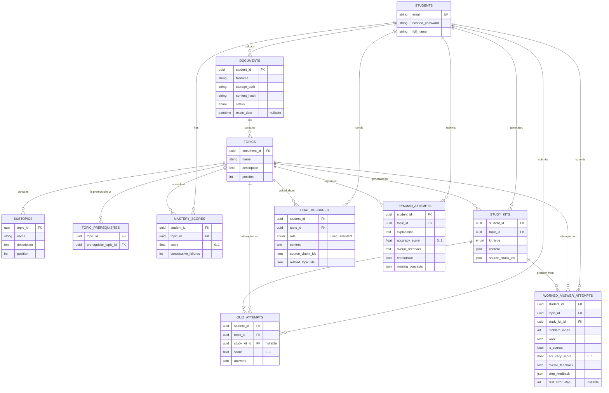

# Data Model

Postgres schema, managed by Alembic (`backend/migrations/`). Every table
has a UUID primary key (`id`) and `created_at`/`updated_at` timestamps via
shared mixins (`src/db/models/mixins.py`); those columns are omitted below
for brevity.

## Tables

| Table | Purpose |
| --- | --- |
| `students` | Auth identity (`email` unique, bcrypt `hashed_password`) and display name. |
| `documents` | One uploaded syllabus/notes file. Doubles as the "course" concept: `exam_date` lives here (nullable) since a student can have more than one course, each with its own timeline. `content_hash` backs upload idempotency (Phase 2). `status` tracks ingestion progress. |
| `topics` | Top-level topic extracted from a document, ordered by `position`. |
| `subtopics` | Child of a topic, same shape as `topics` (`name`, `description`, `position`). |
| `topic_prerequisites` | Directed edge: `prerequisite_topic_id` must be learned before `topic_id`. Unique on the edge pair, checked to disallow self-loops. |
| `mastery_scores` | One row per `(student, topic)` — updated in place by `score_and_update_mastery` (Phase 3), not appended. `consecutive_failures` backs the remediation trigger. |
| `study_kits` | A generated study asset (`kit_type`: summary/flashcards/quiz/problem_guide). `content` is the kit's JSON payload; `source_chunk_ids` records the Chroma chunk ids it was grounded in, for citation. |
| `quiz_attempts` | One submitted quiz attempt, optionally linked to the `study_kits` row it was generated from (`SET NULL` on delete). |
| `chat_messages` | One turn (`user` or `assistant`) in a topic-scoped Q&A chat. An assistant turn's `source_chunk_ids` and `related_topic_ids` are both empty for a refusal — there's no separate "was this covered" column; the API derives it from whether either list is non-empty (see `api-reference.md` → Chat). |
| `feynman_attempts` | One Feynman-mode explanation attempt, graded claim-by-claim. `breakdown` is the graded claim list (JSON); `accuracy_score` also feeds `mastery_scores` at grading time via `apply_mastery_observation` — this row is the durable record of *why* mastery moved, not a second source of truth for the score. |
| `worked_answer_attempts` | One attempt at working out a specific problem. `study_kit_id` + `problem_index` locate the reference `Problem` inside that `problem_guide` kit's stored `content.problems` — there's no separate "problems" table. `step_feedback` is the graded per-step list (JSON); `first_error_step` is nullable (no error found). |

## Conventions

- All foreign keys `ON DELETE CASCADE`, except `quiz_attempts.study_kit_id`
  (`SET NULL` — losing the kit shouldn't delete attempt history).
- Constraint names follow a fixed naming convention
  (`src/db/base.py: NAMING_CONVENTION`) so Alembic autogenerate is
  deterministic across machines.
- `mastery_scores.score` and `quiz_attempts.score` are both checked to
  `[0, 1]` at the database level, not just in application code.
- Every query in `src/domain` and `src/api` must filter by the
  authenticated student's id — the schema does not enforce row-level
  security itself (see `runbook.md`, once it exists, for the current
  stance on this).

## Not modeled yet

Chroma chunk records (id, embedding, metadata, source document/topic) live
in the vector store, not Postgres — `src/core/vectorstore.py` owns that
connection. They're written starting in Phase 2.
