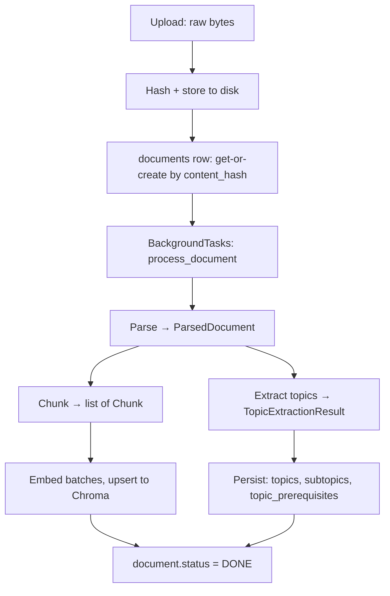

# Ingestion Pipeline

Turns an uploaded PDF/DOCX/PPTX into stored chunks (Chroma) and a topic
graph (Postgres). Entry point: `ingestion.pipeline.process_document`,
run as a background job by `POST /documents/upload`.

## Parsing (`ingestion/parsers/`)

One module per format, all normalized to `ParsedDocument` (a title plus a
tree of `ParsedSection`, each with a `heading`, `level`, own `text`, and
`children`). Dispatch is by file extension (`parsers/__init__.py:
parse_document`).

| Format | Heading source | Structure |
| --- | --- | --- |
| DOCX | `Heading N` / `Title` paragraph styles | Real nested tree — a `Heading 2` nests under the preceding `Heading 1`. Tables are converted to `"cell \| cell"` rows and attached as text to whichever section is currently open. |
| PPTX | Slide title placeholder | Flat — one section per slide, no nesting. |
| PDF | Best-effort: a short first line with no sentence-ending punctuation | Flat — one section per page. `pypdf` carries no font/style metadata, so real heading detection isn't possible; a page that doesn't look like it starts with a heading keeps `heading=None`. |

A document's title comes from DOCX's `Title` style, the PPTX's first
slide's title, or the PDF's embedded metadata title — whichever the
format actually has.

## Chunking (`ingestion/chunker.py`)

Walks the section tree depth-first; each section's own text (not its
children's) is split independently, so a chunk never straddles a heading
boundary. Word count stands in for token count — model-agnostic, and close
enough for a *target* size. Defaults: `chunk_target_tokens=400`,
`chunk_overlap_tokens=50` (`.env`), both overridable.

Edge cases (see `tests/ingestion/test_chunker.py`): no headings at all
(single heading-less section, still chunks), a document shorter than the
target size (one chunk, unmodified text), and table-shaped text (chunks
without crashing; no word is dropped).

## Embedding (`ingestion/embedder.py`)

Batches chunk texts (`embedding_batch_size`, default 32) through
`LLMClient.embed`, then upserts into the student's Chroma collection
(`core/vectorstore.py` — one collection per student,
`{prefix}_student_{student_id}`) with `id = "{document_id}:{chunk.order}"`
and metadata `{document_id, order, section_heading, token_count}`.

**Idempotency**: every call first deletes existing entries matching
`document_id` in that collection, so re-embedding a re-uploaded document
replaces rather than duplicates its chunks.

## Topic extraction (`ingestion/topic_extractor.py`)

One `LLMClient.chat_json` call per document, constrained to
`TopicExtractionResult` (a list of `{name, description, subtopics,
prerequisites}`). The prompt gets a bounded outline (headings + a text
excerpt per section, capped at 8000 characters) rather than full chunk
text — enough signal for topic extraction without the prompt scaling with
document length.

`persist_topics` writes `topics` rows first (flushing to get their ids),
then `subtopics`, then resolves each topic's `prerequisites` (referenced
by name within the same extraction) to `topic_prerequisites` edges —
dropping (and logging) any prerequisite naming an unknown topic or itself,
rather than failing the whole extraction over one bad edge.

## Idempotent re-upload

Re-uploading identical bytes (same SHA-256) reuses the existing
`documents` row (`domain.documents.create_or_replace`) and, on the next
`process_document` run, does a **full replace** of that document's topics
and chunks — not a merge against the previous extraction. See
[decisions/0003-reupload-replaces-topics.md](decisions/0003-reupload-replaces-topics.md)
for why, and what it costs (cascade-deletes any `mastery_scores`/
`study_kits`/`quiz_attempts` tied to the old topics).

## Failure handling

Any exception during `process_document` sets `document.status = FAILED`,
logs the exception (with traceback), and re-raises — surfaced to
whatever's watching the background task (currently: server logs; see
[decisions/0004-background-tasks-not-a-queue.md](decisions/0004-background-tasks-not-a-queue.md)
for why there's no separate worker to retry it). A model response that
fails schema validation raises `LLMError` and is treated as a hard
failure, never a silent best-effort guess.

## Testing without a live Ollama key

Every ingestion test runs against a `FakeLLMClient` (deterministic,
in-memory) rather than live Ollama Cloud — see `tests/conftest.py`. The
embedder and topic-extractor tests still exercise real Postgres and real
Chroma (via the dockerized services), so the only thing faked is the
model call itself. `tests/api/test_documents.py` drives the entire
pipeline through the real `POST /documents/upload` endpoint this way,
asserting the exact topic count and chunk count a fixture syllabus
produces.
