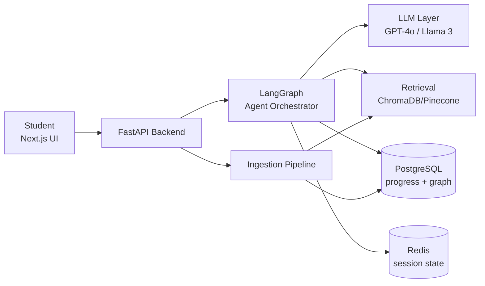
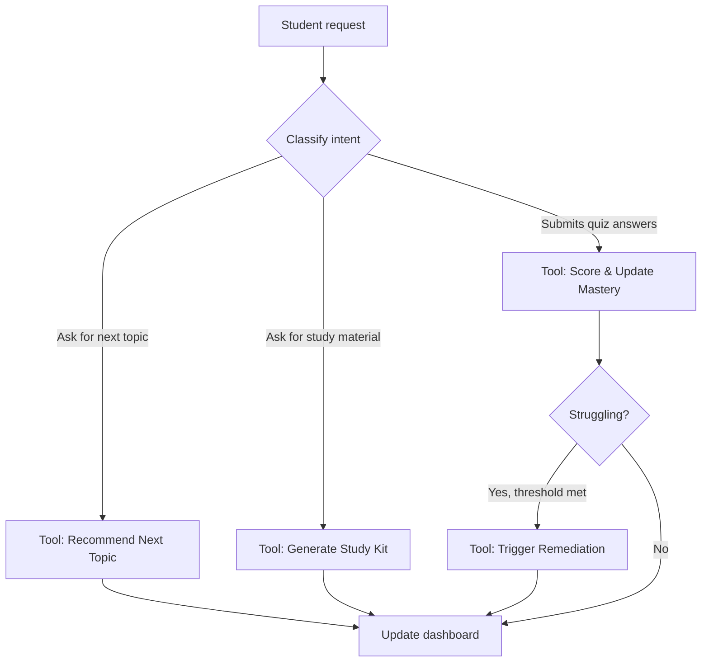

# Personalized Learning Path Generator — Project Plan

2026-09-22 · @Someone

## 1. Executive Summary & Objectives

**Problem statement.** Students struggle to convert a syllabus into an efficient study plan: they don't know which topics matter most, where their own gaps are, or what to study next as exam dates approach. Generic study guides and static flashcard decks don't adapt to an individual's actual mastery or a shrinking timeline.

**Strategic objective.** Give each learner an autonomous tutor that turns any syllabus into a structured knowledge graph, continuously measures mastery per topic, and always tells the learner the single highest-value next study action — generating the actual study material (summary, flashcards, quiz, or worked problems) on demand.

**In scope**

- Syllabus/notes ingestion (PDF, DOCX, slides) → topic/subtopic knowledge graph
- Progress tracking and mastery scoring per topic
- Adaptive next-topic recommendation, weighted by exam date
- Remediation workflow triggered by repeated struggle signals
- On-demand generation of summaries, flashcards, quizzes, and problem-solving guides
- Mastery dashboard (learner-facing)

**Out of scope (v1)**

- Live/human tutor marketplace or video tutoring
- Grading of free-form essays or proctored exams
- Institution-wide LMS integration (Canvas, Moodle) — planned as a post-v1 connector
- Multi-learner classroom analytics for instructors
- Native mobile apps (web-responsive only in v1)

## 2. System Architecture

**High-level architecture**

**Data ingestion pipeline.** Uploaded syllabus/notes (PDF, DOCX, PPTX) are parsed, OCR'd where needed, and split into semantic chunks by heading structure. Each chunk is embedded and written to the vector store (ChromaDB/Pinecone); extracted topics and their prerequisite relationships are written as nodes/edges to PostgreSQL as the knowledge graph. Ingestion is idempotent per document hash, so re-uploads update rather than duplicate.

**Component interaction.** A student request enters through the Next.js UI and hits a FastAPI endpoint. FastAPI loads session state from Redis and hands the request to the LangGraph orchestrator, which decides which tool to call (retrieve context, query mastery scores, generate a study asset, or update progress). The orchestrator calls the LLM with retrieved context, writes any state changes back to PostgreSQL/Redis, and returns a structured response that the frontend renders (dashboard update, new flashcard set, recommendation card, etc.).

## 3. Functional Requirements

**User stories**

| # | As a... | I want... | So that... |
| --- | --- | --- | --- |
| 1 | Student | to upload my syllabus or notes | the system builds a topic map automatically |
| 2 | Student | to see my mastery per topic | I know exactly where my weak spots are |
| 3 | Student | the system to tell me what to study next | I always know the highest-value use of my time |
| 4 | Student | to get extra remediation when I keep missing a topic | I don't fall further behind before an exam |
| 5 | Student | to generate a summary, flashcards, or quiz for a topic on demand | I can study in the format that works for me right now |
| 6 | Student | my plan to shift automatically as my exam date nears | study time is prioritized correctly under time pressure |

**Acceptance criteria (representative)**

- Syllabus upload → knowledge graph: topics/subtopics are extracted and stored within 30 seconds for a 20-page document; each node has a prerequisite edge where the source text implies one.
- Next-topic recommendation: returned in under 3 seconds, always includes a one-line justification (e.g. "lowest mastery score, exam in 4 days").
- Remediation trigger: fires automatically after 2 consecutive quiz failures or a mastery score drop of ≥ 20% on a topic, and surfaces a revised mini-plan within the same session.
- Study-kit generation (summary/flashcards/quiz/problem guide): returned within 5 seconds for cached context, within 15 seconds when fresh retrieval is required; every generated fact is traceable to a source chunk from the learner's own uploaded material.
- Mastery dashboard: updates within 1 second of a quiz submission.

## 4. Technical Specifications

**Technology stack**

| Layer | Choice | Notes |
| --- | --- | --- |
| Frontend | Next.js 14, React 18, Tailwind CSS 3 | SSR dashboard, client-side quiz/flashcard interactions |
| Backend | FastAPI (Python 3.11) | Async endpoints, Pydantic v2 schemas |
| Agent framework | LangGraph 0.2 (on LangChain 0.2) | Explicit agent-loop graph, not a free-form agent |
| AI layer | GPT-4o (primary), Llama 3 70B (fallback/self-hosted option) | Model choice configurable per deployment |
| Relational store | PostgreSQL 15 | Knowledge graph, users, progress, mastery scores |
| Vector store | ChromaDB (self-hosted) or Pinecone (managed) | Chunk embeddings for RAG |
| Session/cache | Redis 7 | Session state, rate limiting, short-lived agent memory |

**API documentation (primary endpoints)**

| Endpoint | Method | Purpose | Auth |
| --- | --- | --- | --- |
| /documents/upload | POST | Upload syllabus/notes, trigger ingestion | Bearer JWT |
| /graph/{course\_id} | GET | Fetch the topic/subtopic knowledge graph | Bearer JWT |
| /progress/{student\_id} | GET | Mastery scores per topic | Bearer JWT |
| /recommendation/next | GET | Next recommended topic + justification | Bearer JWT |
| /study-kit/generate | POST | Generate summary, flashcards, quiz, or problem guide for a topic | Bearer JWT |
| /quiz/submit | POST | Submit quiz answers, update mastery, may trigger remediation | Bearer JWT |

All endpoints return JSON; errors follow a standard `{code, message}` envelope. Auth uses short-lived JWTs issued by the auth service, refreshed via a rotating refresh token.

**Infrastructure requirements**

- Deployment: Docker Compose for local/dev; AWS (ECS Fargate or EKS) for staging/production
- Minimum per-service resources: API 0.5 vCPU / 1 GB RAM (scales horizontally); LLM calls routed to hosted providers (no local GPU required for the GPT-4o path); optional GPU node (A10/L4 class) only if self-hosting Llama 3
- PostgreSQL: managed instance (e.g. RDS), 2 vCPU / 8 GB to start
- Redis: managed instance (e.g. ElastiCache), single small node for v1
- Object storage (S3 or equivalent) for raw uploaded documents

## 5. AI & Agentic Framework Logic

**Prompt engineering strategy.** The system prompt fixes the tutor's role, constrains it to the learner's own uploaded material plus the derived knowledge graph, and requires every generated fact to cite the source chunk it came from. Task-specific prompts (summary, flashcards, quiz, problem guide) are separate templates layered on top of the shared system prompt, each with its own output schema so the frontend can render it directly.

**RAG implementation.** Chunking follows document structure (headings/sections, \~300–500 tokens with overlap). Retrieval is hybrid: semantic search over the vector store first, with a keyword/BM25 fallback when semantic similarity is low (common for terse technical terms, formulas, or proper nouns). Retrieved chunks are re-ranked against the target topic node before being passed to the LLM, and only chunks above a similarity threshold are used — below it, the agent says the material doesn't cover the topic rather than guessing.

**Agentic decision-making (agent loop).**

The orchestrator (LangGraph) routes on classified intent rather than letting the LLM freely choose tools: this keeps behavior predictable and auditable. Each tool call is logged with its inputs/outputs for later review.

**Guardrails & hallucination control.** Responses are grounded to retrieved chunks only, with inline citations back to the source document; low-confidence retrieval returns an explicit "not covered in your materials" rather than a generated guess. Generated quizzes and flashcards are validated against the source chunk before being shown (a lightweight consistency check step). All AI outputs are logged with the retrieved context that produced them, so any flagged answer can be traced and corrected.

## 6. Security & Compliance Standards

**Data privacy.** Student PII (name, email, institution) is stored separately from learning content and encrypted at rest; uploaded documents and derived embeddings are scoped per-user and never used to train shared models. Logs are scrubbed of PII before any use in debugging or analytics. Learners can export or delete their data (documents, progress, mastery history) on request.

**Access control.** JWT-based authentication with short-lived access tokens and rotating refresh tokens; role-based authorization separates student, (future) instructor, and admin scopes. All data access is scoped to the owning student at the database-query level, not just the API layer.

**Compliance.** Designed to align with FERPA (US educational records) and GDPR (EU data subjects) principles: data minimization, explicit consent for uploads, right to deletion, and audit logging of access to student records. Where the product is deployed for a school or institution, a data processing agreement governs data ownership and retention.

## 7. Success Metrics & Validation (KPIs)

| Category | Metric | Target |
| --- | --- | --- |
| Performance | Recommendation latency | < 3 s (p95) |
| Performance | Study-kit generation latency | < 15 s cold, < 5 s cached (p95) |
| Performance | System availability | 99.5% monthly uptime |
| Accuracy | Citation precision (generated facts traceable to source) | ≥ 95% |
| Accuracy | Quiz-answer correctness (validated against source) | ≥ 98% |
| Accuracy | Knowledge-graph extraction recall (topics found vs. present in syllabus) | ≥ 90% |
| Adoption | Weekly active learners returning to the dashboard | ≥ 3 sessions/week per active learner |
| Adoption | Time-to-first-study-kit after upload | < 2 minutes |
| Adoption | Reported time saved vs. self-planned study (survey) | ≥ 30% |

## 8. Project Roadmap & Milestones

| Phase | Duration | Deliverables |
| --- | --- | --- |
| Phase 1 — Environment & ingestion | Weeks 1–3 | Repo/infra setup, Docker Compose, PostgreSQL + vector store provisioned, document upload + parsing + chunking + embedding pipeline working end-to-end |
| Phase 2 — Core logic & agentic workflow | Weeks 4–8 | Knowledge-graph builder, mastery scoring, LangGraph agent loop (recommend / generate / score / remediate), RAG grounding + guardrails |
| Phase 3 — UI & integration | Weeks 9–12 | Next.js dashboard, study-kit views (summary/flashcards/quiz/problem guide), progress visualization, auth, API wiring |
| Phase 4 — Testing, validation & docs | Weeks 13–15 | Accuracy/latency benchmarking against KPIs, security review, load testing, user documentation, launch readiness review |
